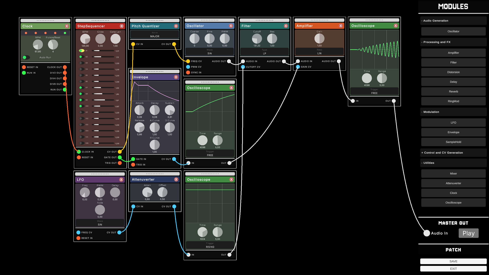

# ModularSynthEngine

Eurorack-style modular audio synthesis engine for Unity.

**Version:** 1.0

**Project page:** [PORTFOLIO-URL]/modular-synth-engine *(portfolio site coming soon)*

## Screenshot

<p align="center">
  
  <br>
  <sub><i>Simple subtractive synthesis patch</i></sub>
</p>

## Demo

Two short clips demonstrating the engine by recreating well-known themes — shared for technical demonstration only, not as a commercial performance:

- [**Recreation of "Confusion" (Pump Panel Reconstruction Mix) by New Order, as used in *Blade* (1998)**](VIDEO-URL-BLADE)
- [**Recreation of the *Stranger Things* intro theme**](VIDEO-URL-STRANGER-THINGS)

These are unofficial, non-commercial, non-monetized recreations built entirely with this engine's modules, made to showcase its sound-design capabilities. No audio or video from the original recordings is included in this repository. All rights to the original compositions belong to their respective composers and rights holders — "Confusion" to New Order / Factory Records, and the *Stranger Things* theme to Kyle Dixon & Michael Stein / Netflix.

## About this file

The full technical report — architecture diagrams, complete module specifications, the full test plan and results, related work, and cost analysis — is attached as a PDF to the [v1.0.0 release](https://github.com/Javaperwave/ModularSynthEngine/releases/tag/v1.0.0). This file only covers what's needed to open the project, understand its structure, and start using it; it does not repeat the report's content, though the sections below are drawn directly from it.

## Overview

ModularSynthEngine is an audio synthesis engine for Unity, written entirely in C# with no external dependencies, that emulates Eurorack-standard analog modular synthesizers. Audio is generated and processed sample-by-sample in real time through `OnAudioFilterRead`, driven by a directed signal graph that connects modules to an `AudioSource`.

The project can be used in three ways:

- **Standalone application** — using the provided UI to build and experiment with patches interactively.
- **Embedded audio engine** — in any Unity project (procedural music, adaptive sound effects, game logic driving synthesis parameters), independent of the UI.
- **Open base for new modules** — extend the module catalog for your own needs.

## Module Catalog

<table>
<tr><td>Oscillator (VCO)</td><td>Delay</td><td>Envelope</td><td>MIDI to CV</td><td>Oscilloscope</td></tr>
<tr><td>Amplifier (VCA)</td><td>Reverb</td><td>Sample &amp; Hold</td><td>Mixer</td><td></td></tr>
<tr><td>Filter (VCF)</td><td>Ring Modulation</td><td>Step Sequencer</td><td>Attenuverter</td><td></td></tr>
<tr><td>Distortion</td><td>LFO</td><td>Pitch Quantizer</td><td>Clock</td><td></td></tr>
</table>

## Architecture (Summary)

Full diagrams and rationale: [report](https://github.com/Javaperwave/ModularSynthEngine/releases/tag/v1.0.0), chapter 2.

Core components:

- **`Synthesizer`** — singleton on the scene's root `GameObject`. Bridges Unity's `OnAudioFilterRead` with the module graph.
- **`Module`** — abstract base class for every module. Implements `execute(data, cv)`, reading and writing the audio buffer.
- **`Port`** — a module's input/output connector. Carries a signal type (`AUDIO`, `PITCHCV`, `MODCV`, `GATE`, `TRIGGER`) and a direction (`INPUT` / `OUTPUT`).
- **`CV`** — represents a patch cable between two ports; holds the reference to the source module.

Signal is **pulled, not pushed**: each module calls `ReadInputPort()` on its inputs, which recursively triggers `execute()` on the connected source module. To avoid redundant work when a module feeds several consumers, each module caches its last computed buffer per audio block, keyed by `AudioSettings.dspTime` (`TryGetFrameCache` / `SaveToFrameCache`).

Signal levels follow Eurorack-style conventions (`CVStandard`):

| Signal | Level |
|---|---|
| Audio | ±5V |
| CV (bipolar) | ±5V |
| Gate | 0/5V |
| Pitch | 1V/octave |

## Using the Engine as a Standalone Library

Full API reference: [report](https://github.com/Javaperwave/ModularSynthEngine/releases/tag/v1.0.0), appendix C.

To embed the engine in your own Unity project, import it and add these components to a `GameObject` with an `AudioSource`:

```
Synthesizer, PatchManager, ModuleFactory, PatchSerializer
```

Any code that creates or connects modules must run after these components have started.

Minimal example — create an Oscillator and connect it to the master output:

```csharp
var master = Synthesizer.Instance.GetMasterOut();
var osc = (Oscillator)ModuleFactory.Instance.CreateModule("Oscillator");
osc.waveform = Oscillator.WaveformType.SIN;
osc.coarse = 12;
PatchManager.Instance.Connect(
    osc.moduleId, "audio_out", master.moduleId, "audio_in");
```

Saving / loading patches:

```csharp
PatchSerializer.Instance.SavePatchToPath(path);
PatchSerializer.Instance.LoadPatchFromPath(path);
```

Creating a new module type, at minimum:

- Inherit from `Module`.
- Implement `Initialize()`, declaring ports via `AddPort(id, label, portType, portDir)`.
- Implement `execute(float[] data, CV cv)`, filling and returning `data[]`.
- Register it with `ModuleFactory.Register()` so it can be instantiated and loaded from saved patches.

## Requirements

Developed and tested with **Unity 6.3.6f1**. Other Unity 6.x versions are likely compatible but haven't been verified.

## Getting Started

1. Clone the repository:
   ```bash
   git clone https://github.com/Javaperwave/ModularSynthEngine.git
   ```
2. Open it with Unity Hub using Unity 6.3.6f1 (or close to it).
3. Load the `MainMenu` scene to reach the interactive UI and try the included patches.

## License

This project is licensed under the **PolyForm Noncommercial License 1.0.0** — see [`LICENSE`](LICENSE).

You're free to use, fork, and modify it for any noncommercial purpose (personal, educational, research, hobby projects, etc.). Commercial use requires a separate license from the author — reach out via GitHub.

## Author

**Javier Balenzategui Garcia**
[github.com/Javaperwave](https://github.com/Javaperwave)

Portfolio: [PORTFOLIO-URL] *(coming soon)*
